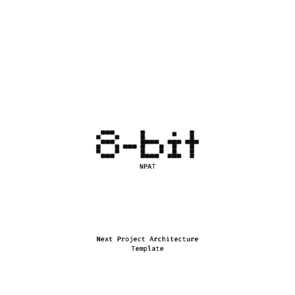

<div align="center">
  <a href="https://github.com/nextjs-architecture">
    
  </a>
</div>

<h1 align="center">You-Project-Name-Here</h1>

## About

This is a Production sample of how a NextJs project should be architected brought to you by "Emmanuel Onah". Feel free to clone it and use it as a base of your next.js projects. Note: Search through the project for "You-Project-Name-Here" and substitute them with your project name.

### Which configurations it comes with:

1. [Http services built on top axios](./src/services/http-services/index.ts)
2. [Design system with styled-component and RadixUI integration](./src/design-system/index.ts)
3. [A git-action that runs the unit test on master and PR branches](/.github/dependabot.yml)
4. [A git-hooks for local-ci that runs your linters and unit-tests](/.husky/_/husky.sh)
5. [A global store mechanism. You don't need to bring in `redux`, `mobix`, or any external global state manager](./src/globalstore/index.tsx)
6. [A PWA integration](/next.config.js)
7. [A test/mock server using msw](./src/mocks/server.ts)

## Technologies used

1. [Next.Js](https://nextjs.org/)

2. [Radix Ui](https://www.radix-ui.com/)

3. [Styled components](https://styled-components.com/)

4. [Jest](https://jestjs.io/)

5. [React testing library](https://testing-library.com/docs/react-testing-library/intro/)

6. [Eslint](https://eslint.org/)

7. [Prettier](https://prettier.io/)

8. [Git Husky](https://typicode.github.io/husky/)

9. [Git Action](https://docs.github.com/en/actions)

10. [Storybook](https://storybook.js.org/)

## Host Environments

1. [Production](replace-your-production-host-here)
2. [Staging](replace-your-staging-host-here)
3. [Development](http://localhost:3000/)

## Architecture used

MVP: we use the "model view presenter" UI flow architecture for separations of concerns

- M(Model): All API communication, Data and business logic lies here
- V(View): All the UI structures that makes up the beautiful UI that the end-users sees lies here. In the case of Next.JS, the whole "DUMMY" UI structures are brought together under the app folder.
- P(Presenter): This is the middle-layer between the Model and the View i.e there is no direct interaction between the Model and the View. So, if the model needs a user input(lets say age-input) to make a http-request, the model will communicate with the Presenter, the presenter will ask the View for the age-input, the View will give the age-input to the presenter, then the presenter will give it to the model, then the model will make the request and give the response(if any exist) to the presenter, and finally the presenter will give the response to the view. Note, the presenter can be a hook, util or even a helper it doesn't matter, it just depends on the context.

__Below is an example of how MVP architecture works in real-life with respect to next.js__

```ts
/models/profile.model.ts => this is the "M=Model"

/hooks/useProfile.presenter.ts => this is the "P=Presenter"

/app/profile.tsx => this is the "V=View"
 
```

## Testing Architecture

Note: ATM, all we are doing is unit-based/integration test. In the future, we plan to introduce e2e test.

Because we don't want to waste your precious time testing just everything, we encourage you to follow the [trophy-testing-pattern](https://subscription.packtpub.com/book/web-development/9781838642655/2/ch02lvl1sec08/understanding-the-testing-pyramid-and-trophy) where realistic testing is done in the integrated-phase which implicitly tests the units(parts that makes up the integrated phase). By the end of your test, ensure that your test has a minimum of 80% coverage by running the ```bash
yarn run test:coverage``` script


## PR convention

When creating a PR, use the below template

```md
# Ticket Title Here

Ticket description here

## Resources below
For example, image 1 and give the images a title e.g Old login page

For example, image 2 and give the images a title e.g New login page

```

## Code convention

We use the "next/core-web-vitals" coding standard which is enforced by an eslint-extension we use. So, ensure to go through at least each file within the folders to get an overview of our coding standards like "imports patterns", "export patterns", "named regular functions", "arrow function", "anonymous function, please don't do this one, we want all our functions to be named at least a-named-function-expression :)"

## Folder naming convention

For all of our folders, we use the kebab-casing convention. e.g components-folder, utils-folder, services-folder, hooks-folder.

## File naming convention

For all file types, we use kebab naming convention only "hooks file we use camelCasing" we . e.g component-file.tsx, useProfile.ts, profile-util.ts

## Scripts

This project uses yarn by default as you can see from the "yarn.lock file", and we recommend it remain so to avoid "multiple lock-files"

__Ensure you are using node version latest__
If you have nvm, run the below command to select the latest node version:

```bash
nvm use
```

## Dependencies installation

```bash
yarn
```

## Development server

```bash
yarn run dev
```

## Production server

```bash
yarn run start
```

Open [http://localhost:3000](http://localhost:3000) with your browser to see the result.

## Production build

```bash
yarn run build
```

## Run unit tests

```bash
yarn run test
```

## Run unit tests coverage

```bash
yarn run test:coverage
```

## Visualize the design system

```bash
yarn run storybook
```

## Lint errors

```bash
yarn run lint
```

## Format errors

```bash
yarn run format
```

## Design system

All our design tokens lies inside the styles folder.

1. __/src/styles/assets:__ this contains our resources e.g images, gif, and videos.

2. __/src/styles/colors:__ this contains our colors.

3. __/src/styles/typography:__ this contains our typographies e.g font-sizes, font-weights, spacing, breakpoints, and everything related to font.

## Enquiry

Incase you have any question or need a suggestion on how to approach your architectural decisions, fee free to write me on [Linkediln](https://www.linkedin.com/in/onah/), i am very much active there and will do my best to assist you with the best practices.